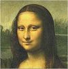
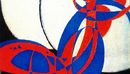

# Evolutionary image compressor
Application approximates image given in .bmp format as a voronoi diagram. Compression can be done using local search, evolutionary algorithm or memetic algorithm. Calculation is accelerated by CUDA.

Documentation can be found [here][https://jakubpetriska.github.io/Evolutionary-image-compressor/doc/html/index.html].

## Example outputs 

## License

    Copyright 2016 Jakub Petriska

    Licensed under the Apache License, Version 2.0 (the "License");
    you may not use this file except in compliance with the License.
    You may obtain a copy of the License at

       http://www.apache.org/licenses/LICENSE-2.0

    Unless required by applicable law or agreed to in writing, software
    distributed under the License is distributed on an "AS IS" BASIS,
    WITHOUT WARRANTIES OR CONDITIONS OF ANY KIND, either express or implied.
    See the License for the specific language governing permissions and
    limitations under the License.